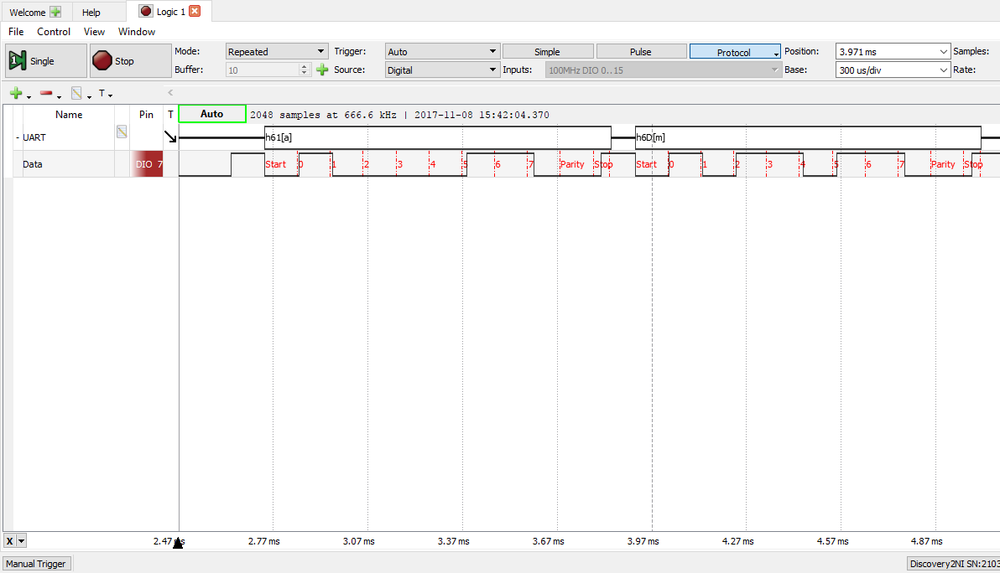

# APS 9 : Serialização/Desserialização - Martim Ferreira e Vitória Camilo 

## Comunicação UART
UART é um tipo de hardware que se comunica de forma assíncrona, serializando os dados. No frame, é enviado um bit HIGH (ou 1) de maneira constante até que a transmissão de dados comece. Quando a transmissão se inicia, é mandado um bit LOW (ou 0), representando o Start Bit, o começo da transmissão. Depois disso, é enviado todo o payload. No final são enviados os Stop Bits, que indicam que a transmissão chegou ao fim.

## Onda gerada pela implementação (no analog discovery)

## Explicação do código
#### Arquivos:
- .ino: Representa a camada físca, onde ocorre a intereção com o Hardware por meio da linguagem C++
- .cpp: Representa a camada Enlace, é onde estão as funções e a lógica
- .h: Importam as bibliotecas Arduino

#### TX (Transmissor)
- .ino: É o código carregado no Arduino, que importa a biblioteca (sw_uart.h) e inicializa a serialização, dando como parâmetros a velocidade, os pinos do Arduino que os Jumpers estão conectados e o texto a ser transmitido.

- .cpp: É responsável pela lógica da comunicação UART. As funções realizam os processos necessários para que a comunicação seja realizada, enquanto o .ino apenas chama essas funções. Dentro deste código, está função que realiza cálculo da paridade ímpar (*calc_even_parity*), recebendo o payload, ela realiza a contagem de cada bit e soma todos os bits 1. Ao final da leitura, se a soma não tem resto quando dividida por 2, a paridade está correta, então ela retorna que o payload não está corrompido (com erro). Outra função presente é a *sw_uart_write_byte*, que escreve o byte que representa o char presente na String sendo enviada, está função basicamente escreve o startbit, o payload (byte do char), parity bit e stopbit.

#### RX (Recepção)
- .ino: É o código carregado no Arduino, que importa a biblioteca (sw_uart.h) e inicializa a serialização, dando como parâmetros a velocidade, os pinos do Arduino que os Jumpers estão conectados e os erros que podem ocorrer na transmissão (Erro de paridade ou outros).

- .cpp: É responsável pela lógica da comunicação UART. As funções realizam os processos necessários para que a comunicação seja realizada, enquanto o .ino apenas chama essas funções. Dentro deste código, está função que realiza cálculo da paridade ímpar (*calc_even_parity*), recebendo o payload, ela realiza a contagem de cada bit e soma todos os bits 1. Ao final da leitura, se a soma não tem resto quando dividida por 2, a paridade está correta, então ela retorna que o payload não está corrompido (com erro). Outra função presente é a *sw_uart_receive_byte*, que recebe o byte transmitido que representa o char, realiza a desserialização dos bits recebidos e checa a paridade por meio da função citada anteriormente e retornando o dado.

