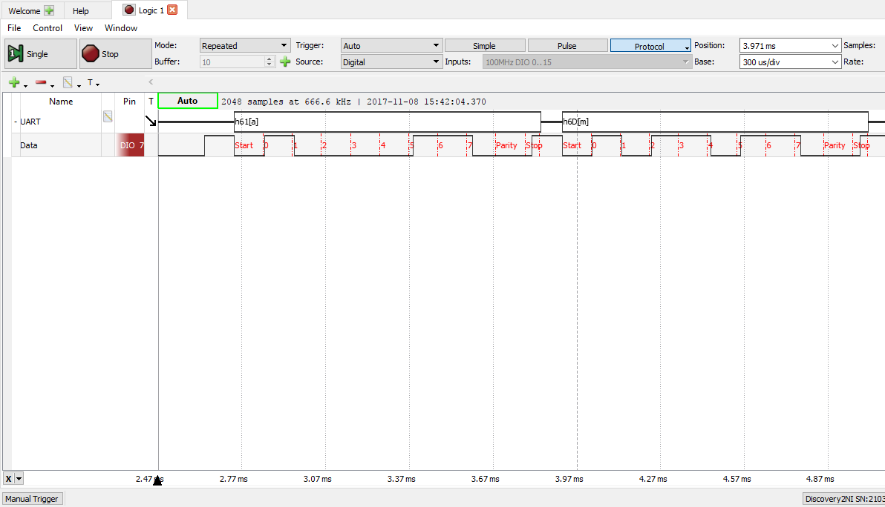

---
title: Camada Física -  APS 9 - Serialização/Desserialização 
author: Rafael Corsi - rafael.corsi@insper.edu.br
date: Outubro - 2017
---

# APS 9 : Serialização/Desserialização - Martim Ferreira e Vitória Camilo 
          
## Documentação

### Explicar a comunicação UART

​
UART é um tipo de hardware que se comunica de forma assíncrona, serializando os dados. No frame, é enviado um bit HIGH (ou 1) de maneira constante até que a transmissão de dados comece. Quando a transmissão se inicia, é mandado um bit LOW (ou 0), representando o Start Bit, o começo da transmissão. Depois disso, é enviado todo o payload. No final são enviados os Stop Bits, que indicam que a transmissão chegou ao fim.

### Exibir a forma de onda gerada pela implementação (usando o analog discovery)

### Explicar o código
