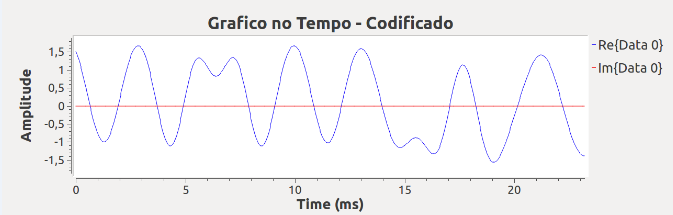
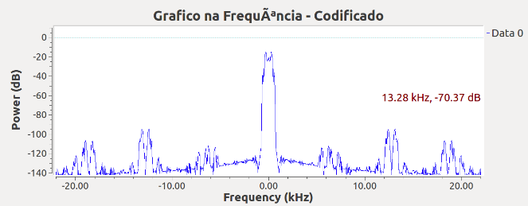
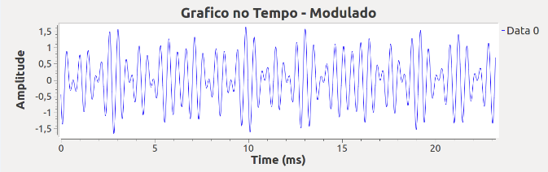
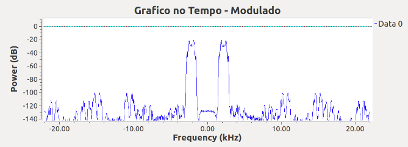
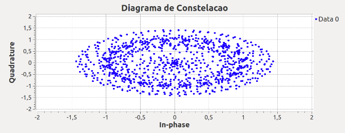
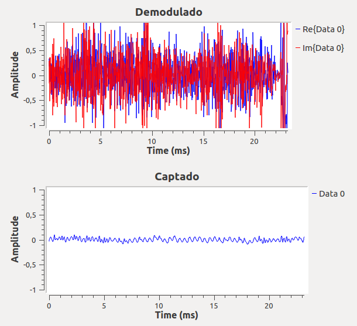
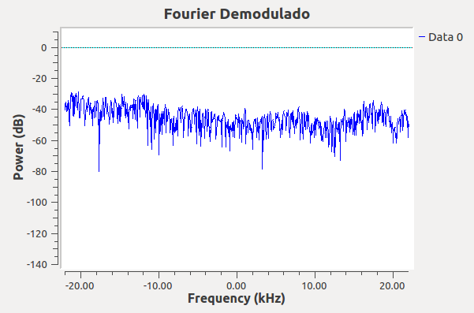
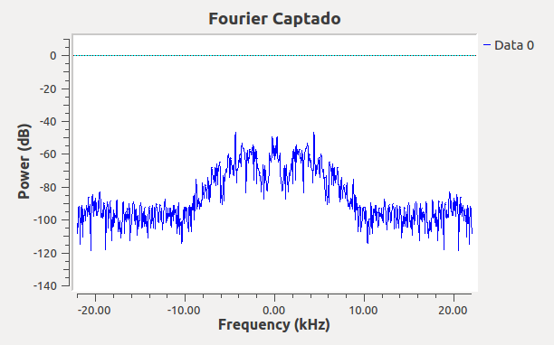
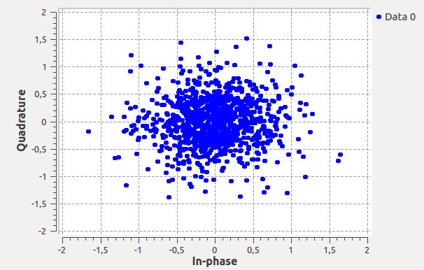

# Modulação e Demodulação BPSK
## Chat
### O que é BPSK?
BPSK (deslocamento de fase binário) é um tipo de modulação digital em que a fase da portadora varia entre 0 e 1 e permanece constante entre os intervalos, sem alterar a amplitude e a frequência. Fazendo isso, ela consegue identificar os símbolos através da mudança da fase, normalmente um seno de estado 0 ou 180°.

### Funcionamento Geral do Projeto
Utilizamos quatro arquivos, dois em python (links) e dois do GNURadio, sendo um de cada tipo representante ou do transmissor da mensagem, ou do receptor. No transmissor, a interface permite que se escreva uma mensagem, como em um chat comum, que será então modulada, e enviada via o socket que foi configurado no arquivo, para que então o receptor estabeleça uma comunicação com o ele e receba os dados via socket, demodulando e exibindo na interface desenvolvida.

### Frequencia de transmissão utilizada e banda que o sinal ocupa
A frequencia utilizada foi de 2200 Hz, pois através de testes empíricos determinamos que era um valor adequado para ambos os computadores. O sinal ocupa uma banda com o dobro dessa frequência.

## GNURadio (Gráficos com explicação)
### Transmissor
Sinal não codificado no tempo (será atualizado)

Sinal não codificado em frequência (será atualizado)

Sinal codificado no tempo

O gráfico apresenta valores de 0 e 1, que representao os valores binarios.

Sinal codificado em frequência

O gráfico apresenta o sinal codificado, que representa os valores binarios.

Sinal modulado no tempo

O gráfico apresenta o sinal codificado modulado em função do tempo para uma determinada portadora

Sinal modulado em frequência

O gráfico apresenta o sinal codificado modulado em função da frequência para uma determinada portadora.

Diagrama de constelação

O diagrama de constelação é a representação da modulação deste sinal. Temos um diagrama elíptico disperso com uma região central um pouco mais focada.

### Receptor

